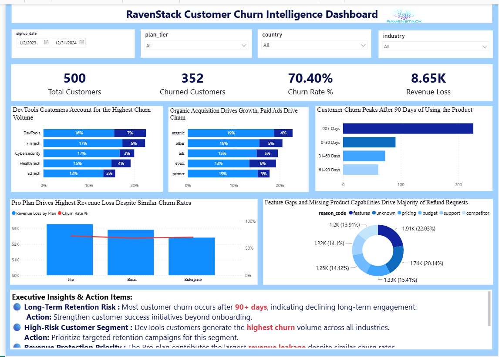

📊 RavenStack SaaS Customer Churn Intelligence
End-to-End Business Analysis Case Study

Identifying Customer Retention Risks, Revenue Leakage & Business Growth Opportunities

Domain: SaaS (Software as a Service)

Project Type: Business Analysis Case Study

Tools: Excel • SQL (MySQL) • Power BI

Focus Areas: Customer Churn • Revenue Protection • Customer Success • Executive Reporting

📖 Executive Overview

Customer churn is one of the most critical challenges for subscription-based SaaS businesses. Losing customers not only impacts recurring revenue but also increases acquisition costs and limits sustainable growth.

This Business Analysis case study investigates customer churn at RavenStack, a fictional SaaS company, using a structured business analysis approach. The project combines Excel, SQL, and Power BI to identify churn drivers, quantify business impact, and provide executive-level recommendations that support customer retention and revenue protection.

Rather than focusing only on dashboard creation, this case study follows the complete Business Analysis lifecycle—from understanding the business problem and stakeholder needs to delivering data-driven insights and strategic recommendations.

## 🎯 Business Problem

RavenStack lacked visibility into why customers were leaving and which factors were driving revenue loss. This analysis was conducted to uncover churn patterns, identify retention risks, and support data-driven business decisions.

## 🧠 Business Objectives
Identify high-risk customer segments
Measure churn impact on revenue
Understand churn timing in lifecycle
Analyze acquisition channel performance
Recommend retention strategies

## 👥 Stakeholder Analysis
CEO / Leadership: churn & revenue visibility
Product Team: feature gaps & product improvements
Marketing Team: acquisition channel quality
Sales Team: high-value customer targeting
Support Team: churn-linked issues

## 📂 Dataset Structure
The analysis uses six relational SaaS datasets covering:
Accounts → Customer profile data
Subscriptions → Plan, billing, churn status
Feature Usage → Engagement behavior
Support Tickets → Customer issues & satisfaction
Churn Events → Refunds & churn reasons

## 📸 Executive Dashboard

The Power BI dashboard highlights customer churn trends, revenue leakage, support risks, and retention opportunities through executive-focused KPIs and business insights.

## 💡 Executive Insights
🔴 Most Customers leave after 90+ days → retention gap
🔵 DevTools contributes the Largest contributor to churn volume
🟠 Support escalations significantly increase churn risk.
🟢 Product feature gaps drive more refunds than pricing concerns.
🟣 Improving customer onboarding offers the greatest retention opportunity.

